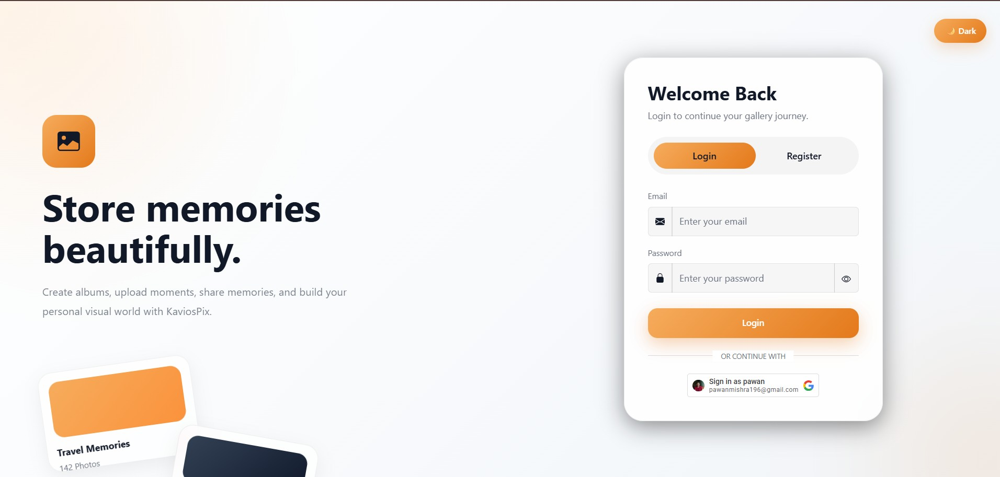
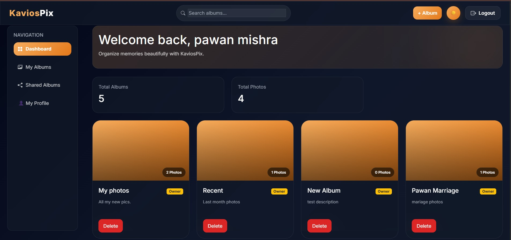
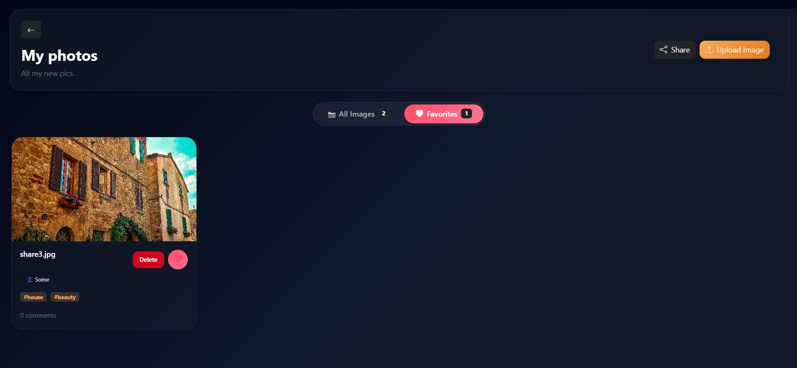

# KaviosPix - AI Powered Photo Management Platform

A full-stack photo management application that allows users to securely upload, organize, manage, and access media assets with cloud-based storage and authentication.

Built with a React frontend, Node.js/Express backend, MongoDB database, and Cloudinary for media hosting.

---

## Demo Link

[Live Demo](https://kavios-pix-frontend-one.vercel.app/)

---

## Quick Start

```bash
git clone https://github.com/pawanx/KaviosPix-Frontend.git
cd KaviosPix-Frontend
npm install
npm run dev
```

---

## Technologies

- React JS
- React Router
- Node.js
- Express.js
- MongoDB
- JWT Authentication
- Cloudinary
- Bootstrap
- Axios
- Google Auth

---

## Features

## Authentication

- Secure user registration and login
- JWT-based authentication
- Protected routes
- Persistent login sessions

---

## Dashboard

- Personalized media dashboard with images, albums statistics.
- View uploaded images in a clean gallery layout
- Quick access to all uploaded assets
- See shared albums by others

---

## Media Upload

- Upload photos securely to cloud storage
- Feature to tag person or add tags based on photos.
- Share the album with other users on the app.

---

## Photo Management

- Modal to view full-size media assets
- Delete uploaded files
- Organize and manage uploaded photos efficiently

---

## Cloud Storage Integration

- Media hosted using Cloudinary
- Fast image delivery
- Optimized asset rendering

---

## Responsive UI

- Mobile-friendly interface
- Clean dashboard layout
- Smooth user experience across devices
- Smooth dark mode intergration.

---

## Screenshots

## Dashboard



---

## Upload Interface



---

## Gallery View



---

## API References

### **POST /api/auth/register**

Register a new user

Sample Response:

```json
{
  "message": "User registered successfully",
  "token": "jwt_token"
}
```

---

### **POST /api/auth/login**

Authenticate existing user

Sample Response:

```json
{
  "message": "Login successful",
  "token": "jwt_token"
}
```

---

### **POST /api/album**

Create new album

Sample Response:

```json
{ 
  "_id" : "507f1f77bcf86cd799439011",
  "name": "Vacation",
  "description": "Album for goa vacation",
  "ownerId" : "897f1f77bcf86cd7994367897"
}
```

---

### **GET /api/album**

Fetch all albums

Sample Response:

```json
[
  {
   "_id" : "507f1f77bcf86cd799439011",
  "name": "Vacation",
  "description": "Album for goa vacation",
   "ownerId" : "897f1f77bcf86cd7994367897",
   "sharedUsers" : ["xyz@example.com"]
  }
]
```

---

### **GET /api/album/:albumId/share**

Share existing album

Sample Response:

```json
{
  "success": true,
  "message" : "Album shared successfully"
}
```

---

### **DELETE /api/album/:albumId**

Delete existing album

```json

{
  "success" : true,
  "message"  : "album deleted successfully.",
  "deletedAlbum" : {
    "_id" : "3242greberbrth45353",
    "name" : "vacation",
    "description": "Album for goa vacation",
  } 
}

```

---

### **POST /api/album/:albumId/images**

Upload new image

Sample Response:

```json
{
  "_id" : "657f1f77bcf86cd799439011",
  "album_id" : "7867f77bcf86cd79943765856",
  "image_id" : "5456rgdft56565",
  "name" : "sunset",
  "tags" : ["sunset","nature"],
  "person" : "John",
  "isFavourite" : false,
  "comments" : ["Nice", "Good"],
  "size" : 34235,
  "imageUrl" : "https://cloudinary.com/image-url"
}

```

---

### **GET /:albumId/images/:imageId/favorite**

favourite/unfavourite an image

Sample Response:

```json
{
  "success" : true,
  "message" : "favourite status updated",
  "isFavourite" : true
}

```

---

## Project Architecture

Frontend:
- React
- Routing
- State Management
- API Integration

Backend:
- Express Server
- Authentication Middleware
- Cloudinary Integration
- MongoDB Models

Database:
- MongoDB Atlas

---

## Future Improvements

- AI-powered image tagging
- Bulk uploads

---

## Contact

For bugs, collaboration, or feature requests:

📧 **Email:** pawanmishra196@gmail.com

🔗 **Portfolio:** https://portfolio-pawanx.vercel.app

💼 **LinkedIn:** https://www.linkedin.com/in/pawan-mishra-08b3b9133/
